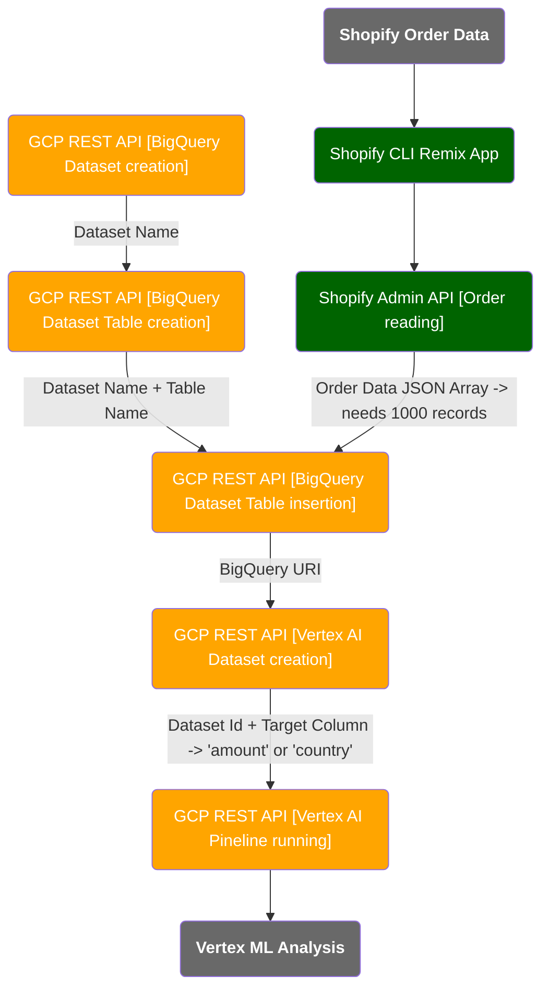

# Shopify GCP Vertex connecting

## Workflow

## How to run
1. Get your GCP project ID from [GCP dashboard](https://console.cloud.google.com/).
2. Get your GCP REST API access token using [the command](https://cloud.google.com/sdk/docs/install) of [gcloud auth print-access-token](https://cloud.google.com/sdk/gcloud/reference/auth/print-access-token) (**note that this token gets expired soon, if you see the error of authentication in your severside console, run the command again to get the latest token**). 
3. Run this app with `shopify app dev` (for more details, read [README.md](./README.md) or [Shopify.dev](https://shopify.dev/docs/apps/build/scaffold-app)).
4. Go to the menu on the app navigation named `GCP Vertex AI Demo`.
5. Input the project id, access token above and other items and click the button on the bottom.
6. After a while, you will see the result link below the button to navigate you to the GCP training detail page.

## If you want to host the app in your remote server, not localhost, follow the steps.
1. Add three environmntal variables `SHOPIFY_API_KEY` (copied from `.env` or your app settings in[partner dashboard](https://www.shopify.com/partners)), `SHOPIFY_API_SECRET` (copied from your app settings in[partner dashboard](https://www.shopify.com/partners)), and `SHOPIFY_APP_URL` (your remote server host as the app top URL like `https://YOUR_APP_NAME.onrender.com`) in your remote server settings or instance.
2. Replace `application_url` and `redirect_urls` in `shopify.app.toml` domains with `SHOPIFY_APP_URL` above to run `shopify app deploy` to apply the change to your app settings.
3. Run `npm install && npm run build && npm run start` in your remote server with this source code uploaded or connecting to this repository. If you use Docker supporting Paas like [Render](https://render.com), just specify `./Dockerfile` in the Docker file path, **you don't need to set any command lines above**.
4. Access to `SHOPIFY_APP_URL` and input your Shopify development store domnain in the center text box and click `login`.
5. The OAuth install happens to redirect you to the app top UI and follow the [How to run] steps above.
6. (Optional: If you want to use session DB in Prisma with aother RDB like `MySQL`, you need more change in [README.md](./README.md). By default, the app uses `SQLite`.)

## Demo
You check how it runs as a video in [Wiki](../../wiki)

## Check the code
You can read the all code in [This file](./app/routes/app.gcp.jsx).

## Notes
- You need more than 1,000 records (orders) at least to run the AI training.
- Training takes a hour or longer, and not guranteed to get finished successfully.

## TODO
- Currently, order items are a few and the training is hardcoded as `classification`. For more effective AI training, more data items and other type and paramaters like forecasting are required. 

## Possible use cases in the future (with more enhancement in TODO)
- Classification of customers based on order data
- Forecasting of country based order average prices
- ... etc.