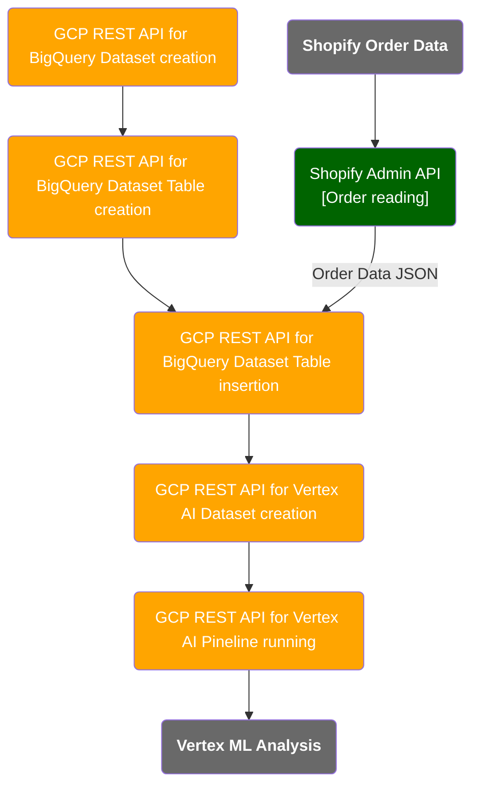

```mermaid

graph TD

  ShopifyOrders("Shopify Order Data")

  ShopifyApi("Shopify Admin API<br/>[Order reading]")

  GcpRestApiBigQueryDataSet("GCP REST API for BigQuery Dataset creation")

  GcpRestApiBigQueryTable("GCP REST API for BigQuery Dataset Table creation")

  GcpRestApiBigQueryInsert("GCP REST API for BigQuery Dataset Table insertion")

  GcpRestApiVertexDataset("GCP REST API for Vertex AI Dataset creation")

  GcpRestApiVertexRun("GCP REST API for Vertex AI Pineline running")

  GcpRestApiVertexResult("Vertex ML Analysis")

  ShopifyOrders-->ShopifyApi

  GcpRestApiBigQueryDataSet-->GcpRestApiBigQueryTable

  GcpRestApiBigQueryTable-->GcpRestApiBigQueryInsert

  ShopifyApi-->|Order Data JSON|GcpRestApiBigQueryInsert

  GcpRestApiBigQueryInsert-->GcpRestApiVertexDataset

  GcpRestApiVertexDataset-->GcpRestApiVertexRun

  GcpRestApiVertexRun-->GcpRestApiVertexResult


  classDef edge1 fill:#696969,color:white,font-weight:bold
  class ShopifyOrders edge1

  classDef shopify fill:#006400,color:white
  class ShopifyApi shopify

  classDef gcp fill:#FFA500,color:white
  class GcpRestApiBigQueryDataSet,GcpRestApiBigQueryTable,GcpRestApiBigQueryInsert,GcpRestApiVertexDataset,GcpRestApiVertexRun gcp

  classDef edge2 fill:#696969,color:white,font-weight:bold
  class GcpRestApiVertexResult edge2


```